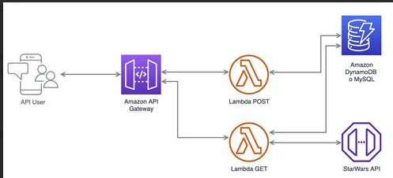
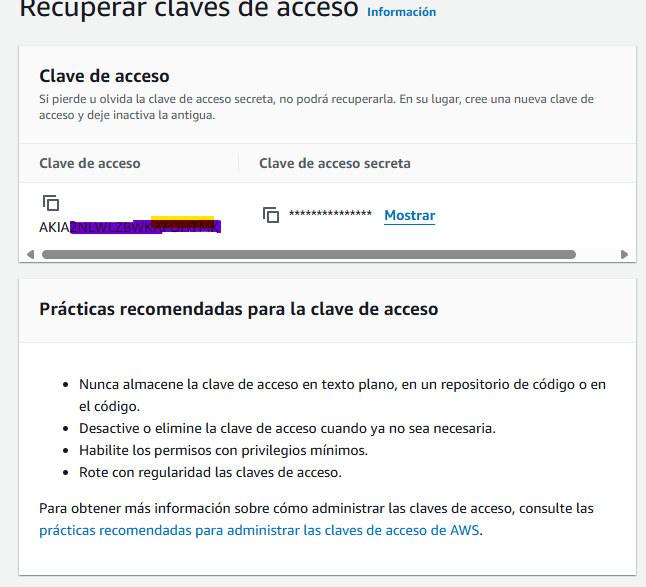
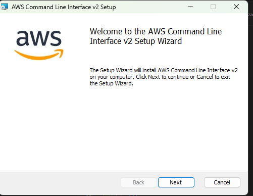

# prueba-tecnica-nodejs
RETO TÉCNICO BACKEND NODEJS

# Descripción del reto técnico:

- Crear una API en Node.js con el framework Serverless para un despliegue en AWS.

- Adaptar y transformar los modelos de la API de prueba. Se tienen que mapear todos los nombres de atributos modelos del inglés al español (Ej: name -> nombre).

- Integrar la API de prueba StarWars API (líneas abajo está el link) se deben integrar uno o más endpoints.

- Crear un modelo de su elección mediante el uso de un endpoint POST, la data se tendrá que almacenar dentro de una base de datos.

- Crear un endpoint GET que muestre la data almacenada.



# Requerimientos

- Node Js 
- AWS CLI
- serverless framework
- GitHub


### Paso 1
Configuración de NodeJs

Actualmente manejo **MVN** para las multiples vversiones de NodeJs que tengo en mi computador, para este caso usaremos la vervion de **Node 16**

### Paso 2
Configuracion de AWS

Con nuestra cuenta de AWS crearemos un usario llamado **__serverless-deployer__**,le vamos a asociar las politicas minimas nesesarias para que pueda realizar el despliegue y la interaccion con los servicios, necesarios para esta prueba.

```
{
	"Version": "2012-10-17",
	"Statement": [
		{
			"Effect": "Allow",
			"Action": [
				"lambda:*",
				"logs:*",
				"apigateway:*",
				"dynamodb:*",
				"cloudformation:*",
				"s3:*",
				"iam:PassRole",
				"rds:*"
			],
			"Resource": "*"
		}
	]
}
```

estos son los roles para el usuario (la variables son diferentes)

```
{
	"Version": "2012-10-17",
	"Statement": [
		{
			"Action": [
				"logs:CreateLogStream",
				"logs:CreateLogGroup",
				"logs:TagResource"
			],
			"Resource": [
				"arn:aws:logs:us-east-1:723523523523:log-group:/aws/lambda/IndraStarWarsAPI-api*:*"
			],
			"Effect": "Allow"
		},
		{
			"Action": [
				"logs:PutLogEvents"
			],
			"Resource": [
				"arn:aws:logs:us-east-1:723523523523:log-group:/aws/lambda/IndraStarWarsAPI-api*:*:*"
			],
			"Effect": "Allow"
		},
		{
			"Effect": "Allow",
			"Action": [
				"dynamodb:PutItem"
			],
			"Resource": "arn:aws:dynamodb:us-east-1:723523523523:table/StarWarsModelsTable"
		}
	]
}
```


Politica de permisos Asociadoal usuario.
y generamos las claves de acceso del usuario programatico.



Instalamos AWS CLI  en nuesta maquina estamo susando Windows


ahora vamos a configurar nuestra credenciales en nuestro Entorno Local, con el comando 

```
aws configure
```

### Paso 3
Configuracion de Serverless 

vamos a instalar serverless en para poder realizar el despliegue con el comando 

```
npm install -g serverless
```

y una ves tengamos toda las configuraciones y el codigo listo ejecutar el comando 

```
serverless deploy --verbose
```


### RESULTADO 

Curl de los EndPoints

POST:  api/add

- En base al codigo id del personaje toma los valores del mismo y los guarda en DynamoBD

```
curl --location 'https://pws72q6kk5.execute-api.us-east-1.amazonaws.com/api/add' \
--header 'Content-Type: application/json' \
--data '{
	"id": 20
}'
```


GET : api/list

- Llama a todos los personajes con las variables en Español

```
curl --location 'https://pws72q6kk5.execute-api.us-east-1.amazonaws.com/api/list
```

GET: api/

- La bienvenida

```
curl --location 'https://pws72q6kk5.execute-api.us-east-1.amazonaws.com/api
```

GET: api/personajes

- Todos los personajes guardados en la BD de DynamoDB

```
curl --location 'https://pws72q6kk5.execute-api.us-east-1.amazonaws.com/api/personajes
```


GET: api/personaje

- Personaje guardado con id  en la BD de DynamoDB

```
curl --location 'https://pws72q6kk5.execute-api.us-east-1.amazonaws.com/api/personajes/:id
```